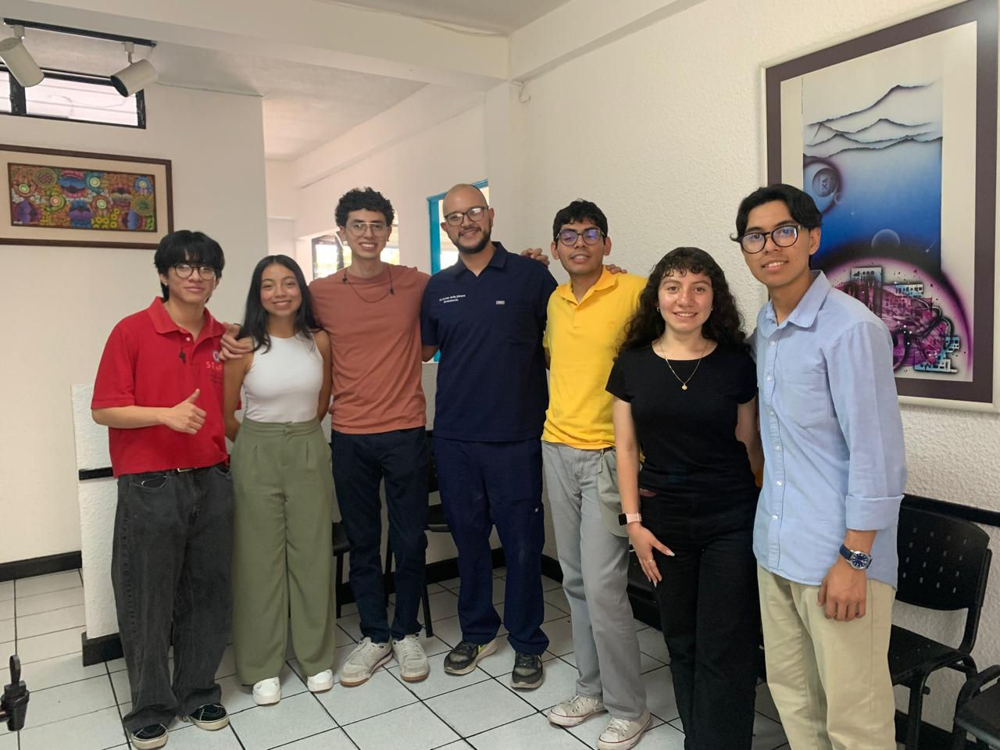
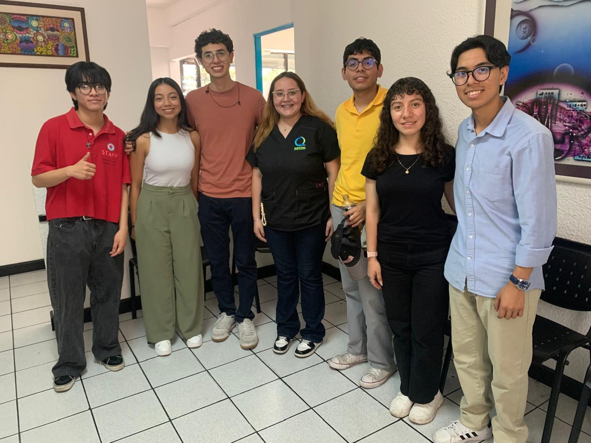
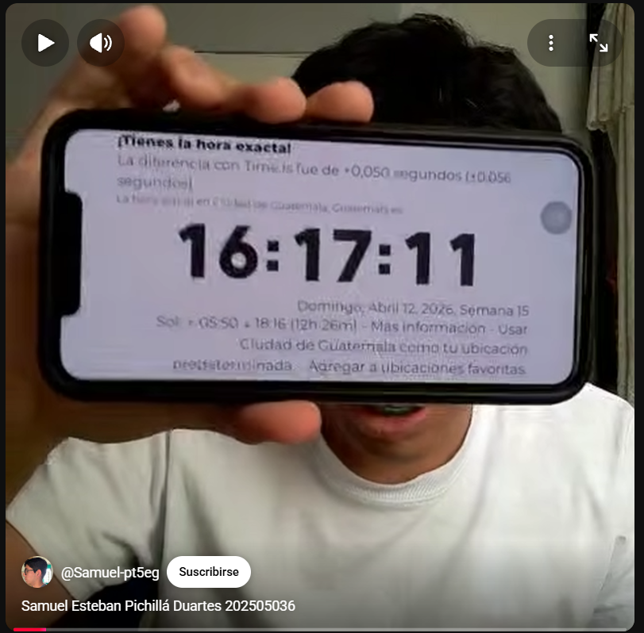
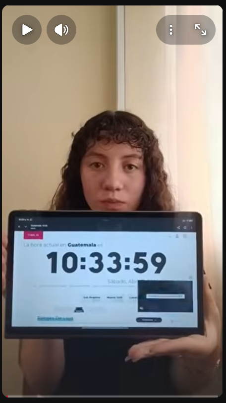
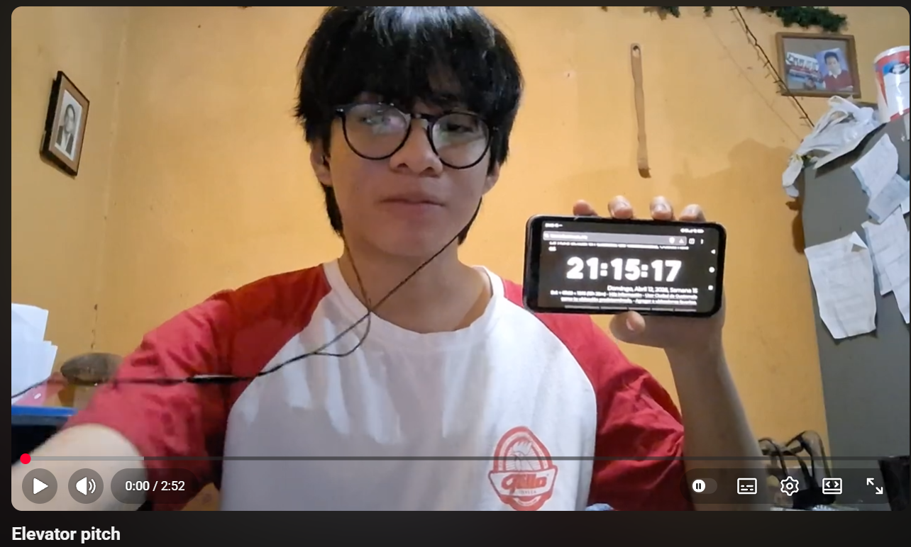

# Evidencias

## Entrevista 1
Se realizó una entrevista a una clínica dental con el objetivo de conocer su funcionamiento, servicios y organización. La actividad fue llevada a cabo por los integrantes del grupo Alvaro, Josselyn y Diego, quienes fueron los principales encargados de realizar las preguntas y recopilar la información.
### Audio
En este apartado se presenta el audio correspondiente a la primera entrevista realizada, donde se recopila la información obtenida durante la conversación.
[entrevista1](ARCHIVOS/AUDIO-ODONTOLOGIA.mp3)
### Fotografía
En este apartado se presentan las fotografías tomadas en la primera entrevista, tanto con el dentista como con la secretaria de la clínica que fue quien respondió las preguntas.

## Entrevista 2
Para la entrevista 2 se escogió un restaurante, la entrevista se realizó con el fin de conocer sus servicios, atención al cliente y dinámica de trabajo. La actividad fue llevada a cabo por los integrantes del grupo Henssen, Anelisse y Samuel, quienes fueron los encargados de realizar las preguntas y recopilar la información.
### Audio
A continuación, se incluye el audio de la segunda entrevista, el cual contiene los detalles y respuestas proporcionadas durante la actividad.
[entrevista2](ARCHIVOS/AUDIO-RESTAURANTE.mp3)
### Fotografía
En este apartado se presenta la fotografía tomada en la segunda entrevista, con los trabajadores que colaboraron respondiendo la entrevista.

## Capturas de Trello
En este apartado se presentan capturas de pantalla de las actividades registradas en Trello, evidenciando la organización y seguimiento de las tareas del equipo.

## Capturas time.is
En este apartado se presentan capturas de pantalla de la página Time.is, donde se evidencia la hora exacta registrada durante la realización de cada actividad.
### Trello

### Samuel

### Josselyn

### Hensen

### Alvaro

### Anelisse

### Diego

### Hora de inicio de la grabación de la junta directiva

## Enlace video de junta directiva
En este apartado se incluye el enlace al video que muestra la dramatización de una junta directiva, buscando la manera de solucionar los problemas evidenciados en el Restaurante Don Juan.

## Enlace a pitches individuales
En este apartado se presentan los pitches individuales, en los que se proponen soluciones a problemáticas identificadas en los negocios entrevistados, demostrando creatividad y análisis por parte de cada uno de los integrantes.  
Samuel: https://youtube.com/shorts/rq4tW6oNIK8  
Josselyn: https://youtu.be/KJ_9xFTIuhA  
Hensen: https://youtu.be/Q9WgbDEltfk?si=U4MeuNPfvXQGfx1w  
Alvaro: https://youtube.com/shorts/jcT89Wm0zqE?si=_FfyAF1F9h2qZUGj  
Anelisse: https://youtube.com/shorts/tSdqNAuTzwU?si=DuOyPEhxAa3azp6P  
Diego: https://www.youtube.com/watch?v=vUQdxLtW2vw  
