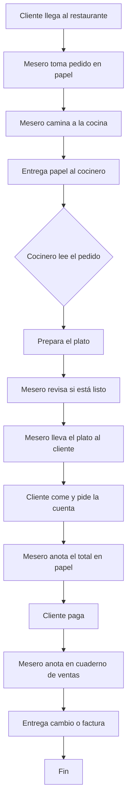
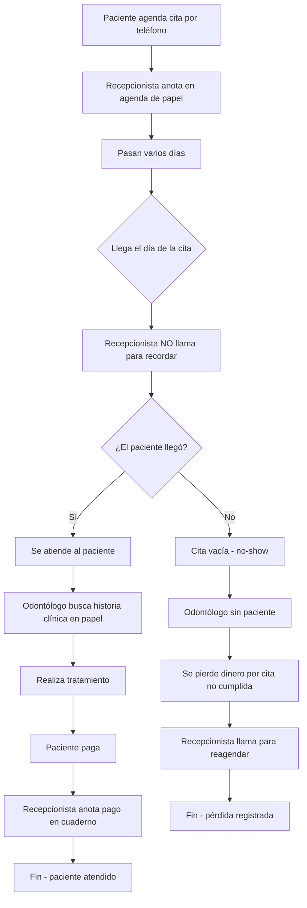

# Diagramas de flujo - Situación actual

## 1. Restaurante

```mermaid
flowchart TD
    A[Cliente llega al restaurante] --> B[Mesero toma pedido en papel]
    B --> C[Mesero camina a la cocina]
    C --> D[Entrega papel al cocinero]
    D --> E{Cocinero lee el pedido}
    E --> F[Prepara el plato]
    F --> G[Mesero revisa si está listo]
    G --> H[Mesero lleva el plato al cliente]
    H --> I[Cliente come y pide la cuenta]
    I --> J[Mesero anota el total en papel]
    J --> K[Cliente paga]
    K --> L[Mesero anota en cuaderno de ventas]
    L --> M[Entrega cambio o factura]
    M --> N[Fin]
```

## 2. Clínica Odontológica

```mermaid
flowchart TD
    A[Paciente agenda cita por teléfono] --> B[Recepcionista anota en agenda de papel]
    B --> C[Pasan varios días]
    C --> D{Llega el día de la cita}
    D --> E[Recepcionista NO llama para recordar]
    E --> F{¿El paciente llegó?}
    
    F -->|Sí| G[Se atiende al paciente]
    G --> H[Odontólogo busca historia clínica en papel]
    H --> I[Realiza tratamiento]
    I --> J[Paciente paga]
    J --> K[Recepcionista anota pago en cuaderno]
    K --> L[Fin - paciente atendido]
    
    F -->|No| M[Cita vacía - no-show]
    M --> N[Odontólogo sin paciente]
    N --> O[Se pierde dinero por cita no cumplida]
    O --> P[Recepcionista llama para reagendar]
    P --> Q[Fin - pérdida registrada]
```
    style O fill:#ff6666,stroke:#333,stroke-width:2px
